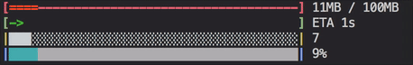

[](https://travis-ci.org/Lancher/increasing)

# Increasing - Coloring Progress-Bar 
✨🌈💥 Coloring Progress-Bar for Your Command-Line/Terminal Applications



## Install

```python
>> pip install increasing
```

## Example

## Feature

## Changelog

###### 0.2
- Add text bar for header and foobar.
- Add example.py and example.png.
- Fix minor errors.

###### 0.1
- Init version.

## TODO

- [x] Progress-Bar 
- [x] Testing on Travis-CI
- [x] PyPi
- [ ] Colors integrated with colorama
- [ ] Windows support
- [ ] Testing on Circle-CI

## License
MIT @ Shi Hao Liu
